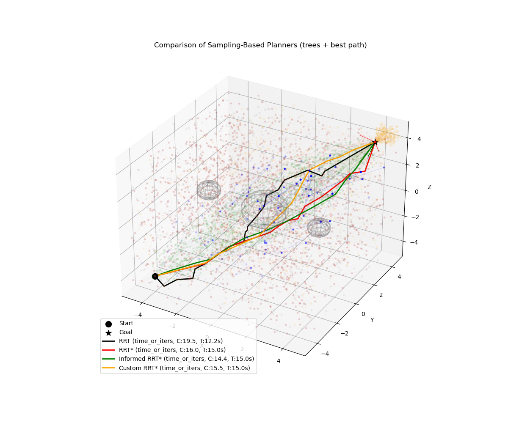
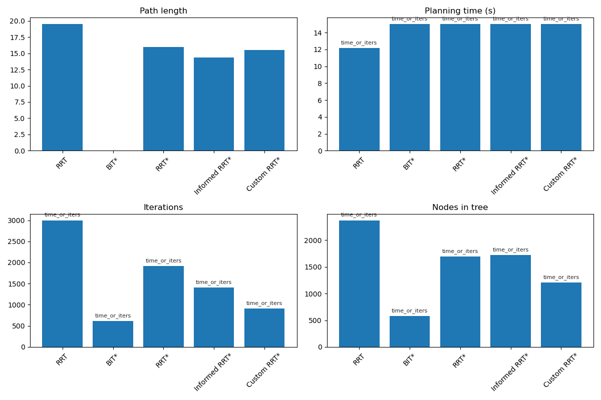

# Comparative Evaluation of RRT-Based Motion Planning Algorithms

This project implements and compares sampling-based path planning algorithms in 3D environments. The implementation includes traditional algorithms (RRT, RRT*) and their optimized variants (Informed RRT*, BIT*, Custom RRT*), with performance analysis across different stopping conditions.

## Project Structure

- **`main.py`** - Main experiment runner for executing planners and generating metrics
- **`src/planner/`** - Algorithm implementations:
  - `rrt.py` - Basic Rapidly-exploring Random Tree
  - `rrt_star.py` - Optimal RRT* algorithm
  - `informed_rrt_star.py` - Informed RRT* with heuristic sampling
  - `bit_star.py` - Batch Informed Trees (BIT*)
  - `custom_rrt_star.py` - Custom RRT* variant
- **`src/common/`** - Utilities for plotting and visualization
- **`media/`** - Generated visualizations and metrics:

## Unity 3D Visualizations

**RRT (Rapidly-exploring Random Tree)**

**RRT* (Optimal RRT)**

**Informed RRT***

**BIT* (Batch Informed Trees)**

**Custom RRT***

<!-- 
**Path Planning Results**
 -->

<!-- **Metrics Comparison**
 -->

## Stopping Conditions

Three evaluation modes are supported:
1. **Fixed Iterations** - Run each planner for a set number of iterations
2. **Time/Iterations** - Stop after time limit OR iteration count
3. **Convergence** - Stop when best cost stabilizes

## Contributors:

  - Yara Mehmood
  - Khang Nguyen
  - Faryal Batool
  - Xuan Phuc Nguyen
  - Jeffrin Sam

## Notes

- All experiments use seeded random number generation for reproducibility
- Metrics are saved as JSON files for post-analysis
- Custom RRT* variant includes optimizations for faster convergence
- Unity visualizations provide intuitive 3D understanding of algorithm behavior